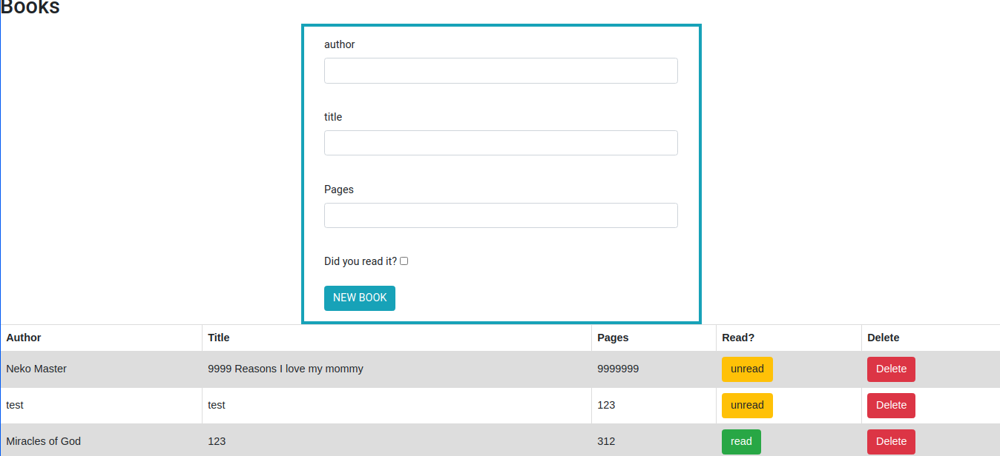

# Library-js
>An easy way to manage a local library in localstorage

## Built With

- HTML
- CSS
- Bootstrap
- JavaScript

## Screenshots



## Getting Started


To get a local copy up and running follow these simple example steps.

### Prerequisites

- Live Server plugin for Visual Studio Code 

### Setup

1- Clone the repository
```
    git clone https://github.com/AbdelrhmanAmin/Library-js.git
```

2- Open the folder on VS Code. 
```
    cd Library-js
    code .
```

3- Right click the index.html file and click on "Open With Live Server"

4- Everything should be running by now. 


## Author

😎 **Abdo Amin**

- GitHub: [@Abdelrhman-Amin](https://github.com/AbdelrhmanAmin)
- Twitter: [@Abdo Amin](https://twitter.com/AbdoAmi60489112)
- LinkedIn: [@Abdo Amin](https://www.linkedin.com/in/abdo-amin-ab786a1b0/)

## Show your support

Give a ⭐️ if you like this project!

## Acknowledgments

- [Microverse](https://www.microverse.org/).